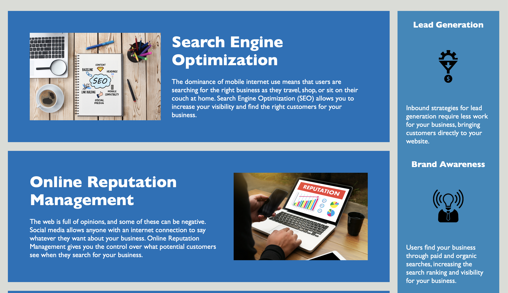
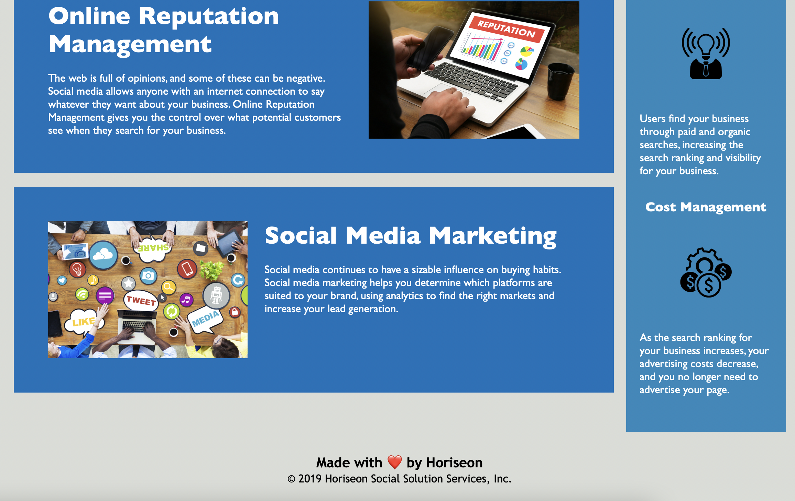

# Horizon-SEO-Refactor

## Description

This code's intention is to meet accessability standards and optimize the website for seach engines. The refactor of the original code allows for greater accessability through use of alts and a more condensed and specific organization. Throughout my refactoring of the code I learned the importance of organization to help others understand your code.

## Links

Use this link to access the GitHub page for this code

* https://mayalorimer.github.io/Horizon-SEO-Refactor/

Use this link to access the Repository

* https://github.com/mayalorimer/Horizon-SEO-Refactor

## Technologies  

* HTML  
* CSS

## Usage

The website can be run directly in the browser. 

## Credits

UCLA Coding Bootcamp Git Lab: https://uclax.bootcampcontent.com/UCLA-Coding-Boot-Camp/UCLA-VIRT-FSF-FT-05-2022-U-LOLC/-/blob/main/01-HTML-Git-CSS/02-Challenge/README.md

## License

MIT License

Copyright (c) [2022] [Maya Lorimer]

Permission is hereby granted, free of charge, to any person obtaining a copy
of this software and associated documentation files (the "Software"), to deal
in the Software without restriction, including without limitation the rights
to use, copy, modify, merge, publish, distribute, sublicense, and/or sell
copies of the Software, and to permit persons to whom the Software is
furnished to do so, subject to the following conditions:

The above copyright notice and this permission notice shall be included in all
copies or substantial portions of the Software.

THE SOFTWARE IS PROVIDED "AS IS", WITHOUT WARRANTY OF ANY KIND, EXPRESS OR
IMPLIED, INCLUDING BUT NOT LIMITED TO THE WARRANTIES OF MERCHANTABILITY,
FITNESS FOR A PARTICULAR PURPOSE AND NONINFRINGEMENT. IN NO EVENT SHALL THE
AUTHORS OR COPYRIGHT HOLDERS BE LIABLE FOR ANY CLAIM, DAMAGES OR OTHER
LIABILITY, WHETHER IN AN ACTION OF CONTRACT, TORT OR OTHERWISE, ARISING FROM,
OUT OF OR IN CONNECTION WITH THE SOFTWARE OR THE USE OR OTHER DEALINGS IN THE
SOFTWARE.